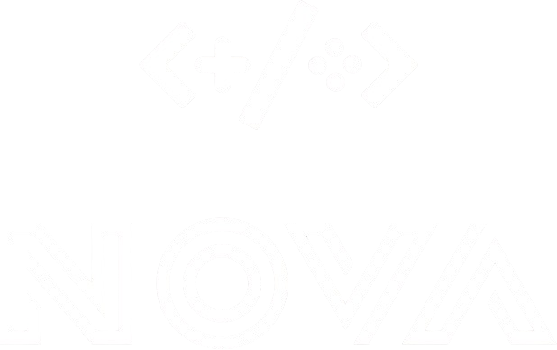

<h1 align="center">Nova</h1>

<div align="center">
    
</div>

<div style="height: 20px "></div>

<p align="center">
    
    <a href="https://github.com/landiluigi746/Nova/actions/workflows/cmake-multi-platform.yml"></a>
    
</p>

Nova is a lightweight 2D game development framework written in **C++20** using **OpenGL 3.3**. It's designed to make building simple games and applications easier and more straight-forward.

**Currently, Nova has been tested only on Windows and Linux.**

## ✨ Features

Currently implemented (after just 4 days of development):

- Texture loading and management
- Shader abstraction and usage
- Mouse and Keyboard input handling
- Integration with **Dear ImGui** for building UIs
- Basic **Asset Manager** for streamlined resource handling
- Modular **Scene System** with functions for lifecycle management (`Start`, `Update`, `Draw`, `ImGuiDraw`, etc.)

## 🔮 Roadmap

Planned features coming soon:

- 🔊 **Sound support**
- 🎞 **Spritesheet management**
- ⚡ **Event system** (input dispatch, custom events)
- 🧩 **GameObject/component system**

## 📦 Dependencies

Nova uses the following libraries:

- [GLFW](https://www.glfw.org/)
- [glad](https://glad.dav1d.de/)
- [GLM](https://github.com/g-truc/glm)
- [fmt](https://github.com/fmtlib/fmt)
- [stb_image](https://github.com/nothings/stb)
- [Dear ImGui](https://github.com/ocornut/imgui)

## 🚀 Getting Started

- [Running the sandbox project](#running-the-sandbox-project)
- [Using Nova with CMake](#using-nova-with-cmake)

### 🛠 Requirements

- OpenGL 3.3+ compatible GPU
- CMake 3.12+
- C++20-compatible compiler

### Running the sandbox project

In order to run the sandbox project (in the `sandbox` directory), follow these steps:

1. Clone the repository:

```bash
git clone https://github.com/landiluigi746/Nova.git
cd Nova
```

2. Build the Nova and sandbox projects:

> 💡 **You can also use your favourite IDE to build the projects and run the sandbox**

```bash
# you can set BUILD_TYPE to either "Release" or "Debug"
cmake -S . -B build -DCMAKE_BUILD_TYPE=Debug
cmake --build build
```

3. Run the sandbox project:

```bash
# or the build type you chose
cd bin/Debug
./sandbox
```

4. Have fun using Nova!

### Using Nova with CMake

The suggested way of using Nova in your own CMake project is to use `FetchContent`.

```cmake
include(FetchContent)

FetchContent_Declare(
    Nova
    GIT_REPOSITORY https://github.com/landiluigi746/Nova.git
    GIT_TAG master
    GIT_SHALLOW TRUE # make sure to use a shallow clone, you don't need the full repo history
)
FetchContent_MakeAvailable(Nova)
```

Now you can access the exposed target `Nova` in your CMake project.

```cmake
# in your CMakeLists.txt (example)
add_executable(MyProject main.cpp)
target_link_libraries(MyProject PRIVATE Nova)
```

## 📝 License

Nova is licensed under the [MIT License](https://github.com/landiluigi746/Nova/blob/master/LICENSE).

## 📝 Acknowledgements

Huge shoutouts to [TheCherno](https://www.youtube.com/@TheCherno) for his OpenGL series and his [Hazel](https://hazelengine.com/) game engine, which served as a great inspiration for this project.

## 👥 Contributing

Contributions are welcome! If you find any bugs or have any suggestions, please [open an issue](https://github.com/landiluigi746/Nova/issues/new) or [submit a pull request](https://github.com/landiluigi746/Nova/pulls).
Contributing guidelines will be added soon.

<p align="center">Drop a ⭐ if you like this project!</p>
